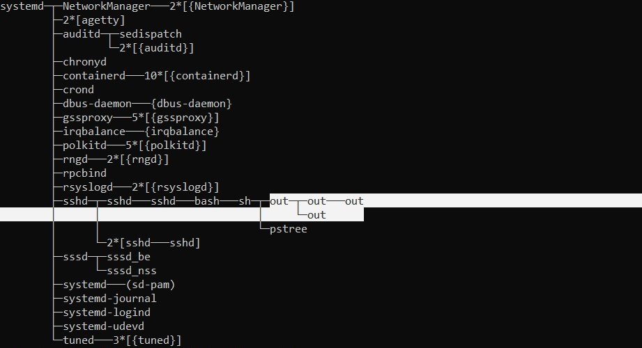

---

### For the start - execute command:
* sh shell_script.sh

### Output:

* execute pstree command:

After 1st fork() call (2 processes):

After 2nd fork() call (4 processes):

After 3nd fork() call (8 processes):

After n fork() calls we have 2^n processes, coz each process calling next fork(). First process is out script.

