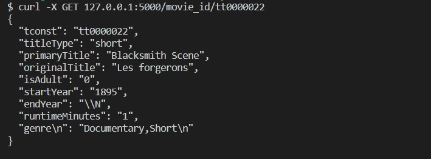
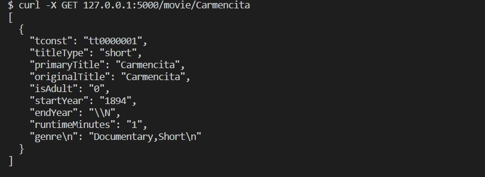
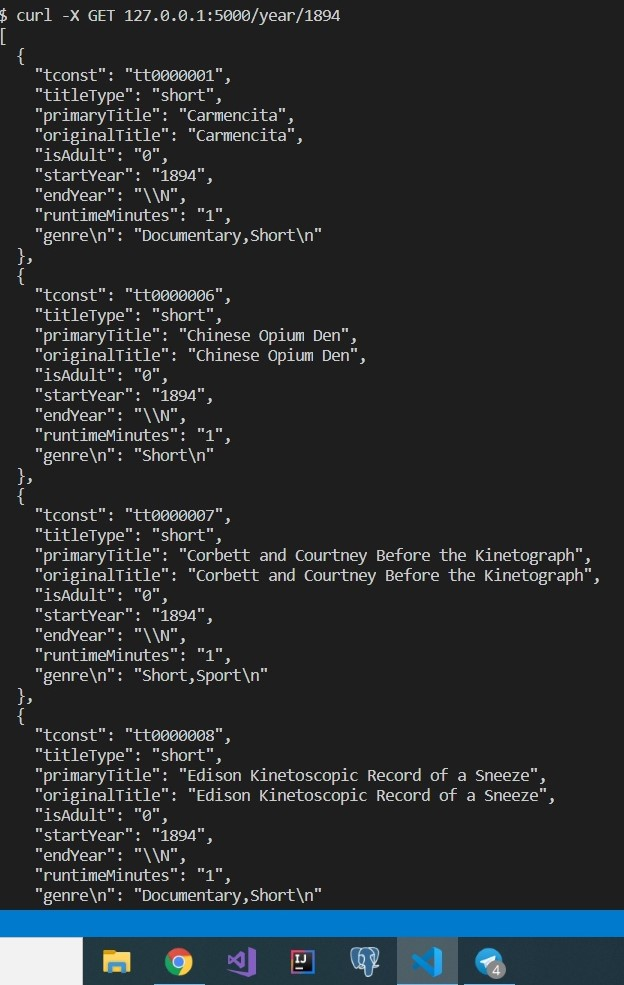
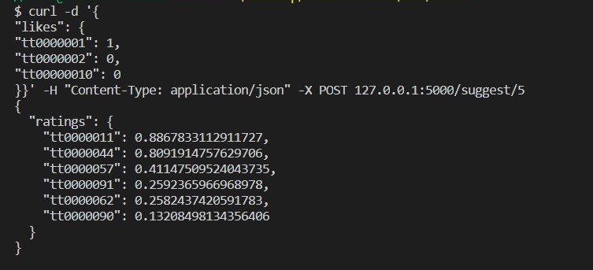

### Full data.tsv u can download at  https://datasets.imdbws.com/title.basics.tsv.gz

# Build and run:

* docker build -t films .
* docker run -d -p 5000:5000 films

# Examples of usage (on test data.tsv at this repo):

## GET by id:
* curl -X GET 127.0.0.1:5000/movie_id/tt0000022

## GET by title:
* curl -X GET 127.0.0.1:5000/movie/Carmencita

## GET by year:
* curl -X GET 127.0.0.1:5000/year/1894

## POST with likes (return suggest of topk films):
* curl -d '{
"likes": {
"tt0000001": 1,
"tt0000002": 0,
"tt00000010": 0
}}' -H "Content-Type: application/json" -X POST 127.0.0.1:5000/suggest/5

---

